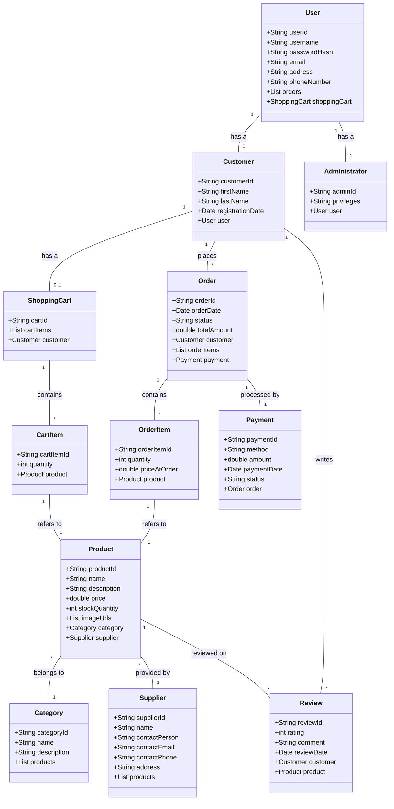

# ThisMe-web-market
Web Market of ThisMe.md repository

# Class Diagram

```mermaid
classDiagram
    class User {
        +String userId
        +String username
        +String passwordHash
        +String email
        +String address
        +String phoneNumber
        +List<Order> orders
        +ShoppingCart shoppingCart
    }

    class Customer {
        +String customerId
        +String firstName
        +String lastName
        +Date registrationDate
        +User user
    }

    class Administrator {
        +String adminId
        +String privileges
        +User user
    }

    class Product {
        +String productId
        +String name
        +String description
        +double price
        +int stockQuantity
        +List<String> imageUrls
        +Category category
        +Supplier supplier
    }

    class Category {
        +String categoryId
        +String name
        +String description
        +List<Product> products
    }

    class Order {
        +String orderId
        +Date orderDate
        +String status
        +double totalAmount
        +Customer customer
        +List<OrderItem> orderItems
        +Payment payment
    }

    class OrderItem {
        +String orderItemId
        +int quantity
        +double priceAtOrder
        +Product product
    }

    class ShoppingCart {
        +String cartId
        +List<CartItem> cartItems
        +Customer customer
    }

    class CartItem {
        +String cartItemId
        +int quantity
        +Product product
    }

    class Payment {
        +String paymentId
        +String method
        +double amount
        +Date paymentDate
        +String status
        +Order order
    }

    class Review {
        +String reviewId
        +int rating
        +String comment
        +Date reviewDate
        +Customer customer
        +Product product
    }

    class Supplier {
        +String supplierId
        +String name
        +String contactPerson
        +String contactEmail
        +String contactPhone
        +String address
        +List<Product> products
    }

    User "1" -- "1" Customer : has a
    User "1" -- "1" Administrator : has a
    Customer "1" -- "0..1" ShoppingCart : has a
    Customer "1" -- "*" Order : places
    Product "*" -- "1" Category : belongs to
    Product "*" -- "1" Supplier : provided by
    Order "1" -- "*" OrderItem : contains
    OrderItem "1" -- "1" Product : refers to
    ShoppingCart "1" -- "*" CartItem : contains
    CartItem "1" -- "1" Product : refers to
    Order "1" -- "1" Payment : processed by
    Customer "1" -- "*" Review : writes
    Product "1" -- "*" Review : reviewed on
```
